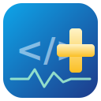
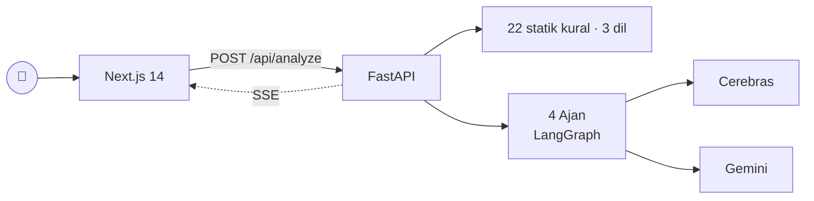

<div align="center">
  

  <h1>KodHekim 🩺</h1>

  <p><strong>Çoklu AI ajan ekibiyle kod sağlığı tanı sistemi</strong></p>
  <p>Reponu kaz, performans / RAM / güvenlik / kalite sorunlarını bul, somut tanı raporu çıkar.</p>

  <p>
    <a href="https://frontend-production-5646.up.railway.app/"><strong>🚀 Canlı Demo</strong></a> ·
    <a href="docs/pitch.md">📄 Pitch</a> ·
    <a href="docs/architecture.md">🏗️ Mimari</a> ·
    <a href="developer.md">📘 Geliştirici Dökümanı</a>
  </p>

  <p>
    <em>BTK Akademi Hackathon 2026 — Finans Teması</em>
  </p>
</div>

---

## ⚡ Hızlı Bakış

KodHekim, GitHub repo URL'sini alıp **4 AI ajan ekibi** ile 22 farklı pahalı/riskli
kod örüntüsünü tespit eder, teknik etkisini sayısal ölçer, her bulgu için Türkçe
**sözel düzeltme reçetesi** (risk + test önerisi dahil) hazırlar ve yazdırılabilir bir
kod sağlığı raporu üretir.

```
Repo sağlık skoru: 62/100
  ├─ Performans: 58/100
  ├─ Güvenlik:   90/100
  └─ Kalite:     71/100

Tespit edilen sorun: 18 (yüksek: 5, orta: 8, düşük: 5)
En kritik: src/api/users.py:47 — N+1 query (~1000 ekstra DB çağrısı/istek)
Düzeltme efor tahmini: ~9 geliştirici saati

▸ Önce/Sonra simülasyonu: tüm fix'ler uygulansa skor 62 → 91
```

## 🎬 3 Ekran

<table>
<tr>
  <td align="center"><strong>Landing</strong><br/><sub>URL + mod + sağlayıcı</sub></td>
  <td align="center"><strong>Canlı Analiz</strong><br/><sub>4 ajan + SSE log</sub></td>
  <td align="center"><strong>Tanı Raporu</strong><br/><sub>Skor + bulgular + reçete</sub></td>
</tr>
<tr>
  <td></td>
  <td></td>
  <td></td>
</tr>
</table>

## 👨‍⚕️ 4 Ajan Ekibi

| Ajan | Karakter | Görev |
|---|---|---|
| 🔍 Profiler | **Dr. Müfettiş** | 22 örüntüyü statik kural motoruyla + LLM confirm ile bulur (Python, JS, TS) |
| 📊 Impact Analyst | **Dr. Ölçücü** | Sorunların teknik etkisini sayısal ölçer (ekstra sorgu, peak RAM, latency) |
| 🩹 Surgeon | **Dr. Cerrah** | Her sorun için Türkçe sözel düzeltme reçetesi + risk seviyesi + test önerisi üretir |
| ⚕️ Chief | **Dr. Hekimbaşı** | Tüm bulguları toplar, sağlık skoru hesaplar, yönetici özeti yazar |

## 🚦 Üç Analiz Modu

| Mod | Hız | Ne yapar | Ne zaman |
|---|---|---|---|
| **Statik** | ⚡⚡⚡ | Yalnızca kural motoru, LLM yok, 0 token | Hızlı CI/CD hook için |
| **Hibrit** *(default)* | ⚡⚡ | Kural + LLM confirm + ajan pipeline | Günlük kullanım |
| **Derin** | ⚡ | AST özeti + tam kod LLM'e direkt | Beklenmedik örüntüler için, küçük-orta repo |

## 🔍 22 Tespit Edilen Örüntü

**Diller:** Python · JavaScript · TypeScript

### Performans (8)
`N1_QUERY` · `SYNC_IN_ASYNC` · `MISSING_INDEX_HINT` · `O_N_SQUARED` · `LARGE_PAYLOAD` · `REPEATED_COMPUTE` · `OVERFETCH_COLUMNS` · `MISSING_TIMEOUT`

### Bellek/RAM (5)
`UNCLOSED_RESOURCE` · `UNBOUNDED_CACHE` · `GLOBAL_ACCUMULATOR` · `LIST_OVER_GENERATOR` · `LOAD_FULL_FILE`

### Güvenilirlik (4)
`UNHANDLED_EXCEPTION` · `RACE_CONDITION` · `DEEP_RECURSION` · `MUTABLE_DEFAULT_ARG`

### Güvenlik (1) — *raporda ayrı bölüm*
`HARDCODED_SECRET` (AWS, Stripe, GitHub, JWT, connection string, generic key)

### Kalite (4)
`INEFFICIENT_STRING_CONCAT` · `CIRCULAR_IMPORT` · `SHADOW_VARIABLE` · `DEAD_CODE`

## 🛠️ Teknolojiler

**Frontend:** Next.js 14 (App Router) · React · TailwindCSS · TypeScript
**Backend:** FastAPI · Python 3.11 · LangGraph · SSE (server-sent events)
**LLM:** Cerebras Cloud SDK (gpt-oss-120b, qwen, llama, glm-4.7) · Google Gemini (2.5 Pro/Flash)
**Analiz:** `ast` (stdlib) · tree-sitter-python · tree-sitter-javascript · tree-sitter-typescript · gitpython

## 🏗️ Mimari



Detay: [docs/architecture.md](docs/architecture.md)

## 🚀 Yerel Kurulum

### Gereksinimler
- Python 3.11+
- Node.js 20+ ve npm 10+
- Git
- Cerebras ve/veya Gemini API anahtarı

### Backend

```powershell
cd backend
uv sync              # bağımlılıkları kurar, .venv oluşturur
cp ..\.env.example ..\.env
# .env içine CEREBRAS_API_KEY ve/veya GEMINI_API_KEY ekle
.\.venv\Scripts\Activate.ps1
uvicorn main:app --reload --port 8001
```

### Frontend

```powershell
cd frontend
npm install
npm run dev          # http://localhost:3000
```

`frontend/.env.local` içinde `NEXT_PUBLIC_API_BASE=http://localhost:8001` olmalı (örnek için bkz. `frontend/.env.example`).

## ✨ Ek Özellikler

- 🎯 **Önce/Sonra simülasyonu** — raporda fix'leri tick'le, sağlık skorunun nereye çıkacağını canlı gör.
- 📊 **Mod karşılaştırması** — Statik / Hibrit / Derin için süre + token + bulgu kıyaslaması.
- 🏷️ **GitHub badge** — README'ye eklenebilen `kodhekim score: 78/100` SVG rozeti.
- 🖨️ **Yazdırılabilir rapor** — `@media print` desteği, tarayıcıdan PDF.
- 🧠 **LLM düşünme stream'i** — ajan çalışırken canlı log.
- 📋 **Reçete kopyala** — tek tıkla Türkçe fix instruction'ı clipboard'a.

## 🚧 Uygulama Kısıtları

> Hackathon MVP'sini stabil tutmak için bilinçli sınırlar koyduk. Hepsi env ile esnetilebilir.

### Repo girişi
| Kısıt | Değer | Env değişkeni |
|---|---|---|
| Repo türü | **Yalnızca public GitHub** (`https://github.com/owner/repo`) | — |
| Maks. klon boyutu | **100 MB** (klon sonrası dizin) | `MAX_REPO_SIZE_MB` |
| Maks. taranan dosya | **200** (önce src/app/lib gibi öncelikli klasörler) | `MAX_FILES_TO_SCAN` |
| Atlanan dizinler | `node_modules`, `.venv`, `dist`, `.next`, `__pycache__`, vendor, build çıktıları | — |

### Dil desteği
| Dil | Uzantılar |
|---|---|
| **Python** | `.py`, `.pyi` |
| **JavaScript** | `.js`, `.jsx`, `.mjs`, `.cjs` |
| **TypeScript** | `.ts`, `.tsx` |

Diğer diller (Go, Java, Rust, vb.) **şu an desteklenmiyor** — yeni dil eklemek için `analysis/languages.py` + tree-sitter parser + statik kurallar gerekir.

### LLM pipeline sınırları
| Aşama | Sınır | Env değişkeni |
|---|---|---|
| Profiler LLM confirm — adaylık üst sınırı | **35 bulgu** | `MAX_PROFILER_LLM_CANDIDATES` |
| Surgeon — reçete üretilen bulgu sayısı | **8** (en yüksek etki skoruna göre) | `MAX_SURGEON_FIXES` |
| Surgeon — tek LLM çağrısında batch | **4** bulgu | `SURGEON_BATCH_SIZE` |
| LLM istek zaman aşımı | **90 saniye** | `LLM_REQUEST_TIMEOUT_SEC` |

### Raporlama
- Skorlama havuzu: en kritik **12** bulgu
- Raporda gösterilen toplam: en fazla **45** bulgu (kalitenin gürültü kuyruğu kısaltılır)
- Mod karşılaştırması: yalnızca Hibrit modunda aktif (Statik ve Derin paralel çalıştırılmaz)

### Sağlayıcı bağımlılığı
- En az **bir** sağlayıcı (`CEREBRAS_API_KEY` veya `GEMINI_API_KEY`) tanımlı olmalı; aksi halde Hibrit/Derin modlar başlamaz, Statik mod LLM olmadan çalışır.
- Pipeline LLM yanıtsız kalırsa **deterministik heuristic fallback** devreye girer (boş rapor üretmez).

## 📂 Repo Yapısı

```
Kod-Hekim/
├── frontend/         # Next.js 14
│   └── app/          # /, /analyze/[jobId], /report/[jobId]
├── backend/          # FastAPI
│   ├── api/          # analyze, stream, report, models, badge
│   ├── agents/       # profiler, impact, surgeon, chief, orchestrator
│   ├── analysis/     # static_rules/ (22 örüntü), scan, ast_parser, js_ts_scan, repo_cloner
│   ├── llm/          # cerebras_provider, gemini_provider, registry
│   └── prompts/      # ajan başına Türkçe prompt'lar
├── docs/             # pitch, architecture, screenshots, logo
└── developer.md      # tam teknik spec
```

## 📘 Geliştirici Dökümanı

Tam teknik detay (mimari, prompt stratejisi, faz roadmap'i, env değişkenleri) için:
**[developer.md](developer.md)**

## 🤝 Katkı

Hackathon submit sonrası katkıya açık. Issue / PR memnuniyetle.

## 📜 Lisans

Bu repo açık kaynaktır. Detay için [LICENSE](LICENSE).

---

<div align="center">
  <sub>Geliştirilmesinde 🤖 kullanıldı, ama kararları biz verdik.</sub>
</div>
