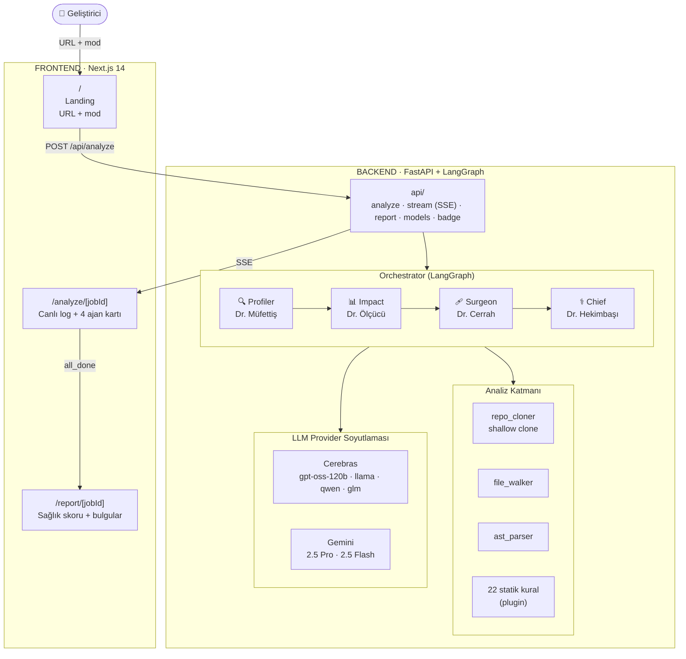
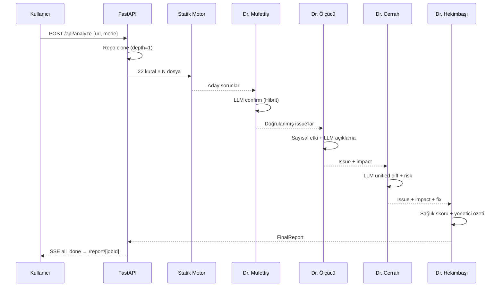

# KodHekim — Mimari

Bu döküman ürünün kuş bakışı mimarisini özetler. Tam teknik detay için
[developer.md](../developer.md).

## Sistem Akışı



## 4 Ajan Pipeline



## Üç Analiz Modu

| Mod | Akış | LLM çağrısı | Tipik süre (50 dosya) |
|---|---|---|---|
| **Statik** | Yalnızca kural motoru + heuristic etki/rapor | 0 | < 5 sn |
| **Hibrit** *(default)* | Kural + LLM confirm + LLM impact/surgeon/chief | ~10–30 | 30–90 sn |
| **Derin** | AST özeti + tam kod LLM'e direkt + pipeline | ~5–15 | 1–3 dk |

## Bileşen Sözlüğü

| Modül | Sorumluluk |
|---|---|
| `backend/analysis/repo_cloner.py` | Shallow clone, boyut/private guard |
| `backend/analysis/file_walker.py` | Uzantı filtresi, exclude dizinler |
| `backend/analysis/ast_parser.py` | `ast.parse` sarıcısı |
| `backend/analysis/static_rules/` | 22 örüntü plugin (her biri ayrı dosya) |
| `backend/analysis/scan.py` | Tüm kuralları sıraya sok, IssueCandidate listesi |
| `backend/llm/` | Cerebras + Gemini soyutlaması (TypedDict response) |
| `backend/agents/` | 4 ajan + orchestrator (LangGraph) |
| `backend/api/` | FastAPI router'ları (analyze, stream, report, models, badge) |
| `frontend/app/` | 3 rota — landing, analyze, report |
| `frontend/lib/` | `api-client.ts`, `sse-client.ts` |

## Veri Tipleri Akışı

```
IssueCandidate (statik)  →  Issue (LLM-confirmed)
                                 ↓
                           ImpactBreakdown
                                 ↓
                            FixSuggestion
                                 ↓
                          FinalReport (health + summary)
```
