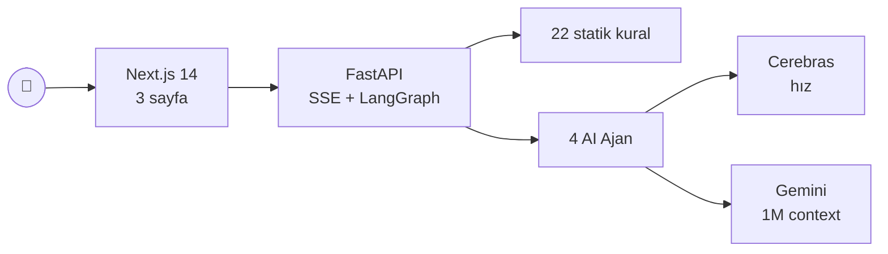

# KodHekim — Tek Sayfada

> **BTK Akademi Hackathon 2026 — Finans Teması**
> Çoklu AI ajan ekibi ile kod sağlığı tanı sistemi

## 🎯 Problem

Kötü yazılmış bir döngü, gereksiz veritabanı sorgusu, sınırsız büyüyen cache,
bellek sızıntısı, timeout'suz HTTP çağrısı — bunlar **görünmez**. Kod
çalıştıkça sunucuyu yorar, RAM'i şişirir, latency'yi yükseltir, instance'ı
upgrade etmeye iter. CTO "faturalar şişiyor" diye yakınır, kimse asıl suçluyu
(kodu) bulamaz.

Geleneksel araçlar bu boşluğu doldurmuyor:
- **Linter'lar** style hatasına bakar.
- **CVE tarayıcıları** kütüphane güvenliğine bakar.
- **APM** runtime metriğine bakar — kaynak kodu okuyamaz.

Kimse **"kod örüntüsü → kaynak baskısı"** bağlantısını kurmuyor.

## 💊 Çözüm

Kullanıcı GitHub repo URL'sini yapıştırır. KodHekim'in **4 AI ajanı** işbaşı yapar:

| Ajan | Karakter | Görev |
|---|---|---|
| 🔍 Profiler | **Dr. Müfettiş** | 22 örüntüyü statik + LLM ile bulur (Python, JS, TS) |
| 📊 Impact Analyst | **Dr. Ölçücü** | Teknik etkiyi sayısal ölçer (ekstra sorgu, peak RAM, latency) |
| 🩹 Surgeon | **Dr. Cerrah** | Her sorun için Türkçe sözel düzeltme reçetesi + risk + test önerisi üretir |
| ⚕️ Chief | **Dr. Hekimbaşı** | Tüm bulguları toplayıp yönetici raporu yazar |

## 📸 3 Ekran

| Landing | Canlı Analiz | Tanı Raporu |
|---|---|---|
|  |  |  |
| URL + mod + sağlayıcı seçimi | 4 ajan kartı + canlı SSE log | Sağlık skoru + bulgular + diff + yazdır |

## 🏗️ Mimari

Detay: [docs/architecture.md](architecture.md) · [developer.md](../developer.md)

## 🎤 Neden Farklıyız

1. **Hibrit analiz** — Linter hızı (`ast`) + LLM bağlam anlayışı.
   - Sadece statik tarama: yanlış pozitif çok.
   - Sadece LLM: yavaş ve pahalı.
   - KodHekim: önce aday üret, sonra LLM confirm → %20 altında FP, hızlı.
2. **3 analiz modu** — kullanım senaryosuna göre seçim:
   - **Statik** (≤ 5 sn, token 0) — CI/CD hook.
   - **Hibrit** (varsayılan) — günlük kullanım.
   - **Derin** (LLM-Direct) — beklenmedik örüntüler için.
3. **Çoklu LLM sağlayıcı** — her ajan farklı model çalıştırabilir.
   - **Cerebras** (gpt-oss-120b, qwen, llama, glm-4.7) — saniyede binlerce token.
   - **Gemini** 2.5 Pro/Flash — 1M context (Derin mod için).
4. **Somut teknik bulgu, parasal değil** — "Ekstra 1000 DB çağrısı/istek"
   bilgisi, "$X kaybı" tahmininden daha ikna edicidir. CTO kendi parasal
   kararını alır.
5. **Türkçe açıklama + ajan karakterleri** — yerel pazara doğrudan hitap;
   geliştirici raporu okurken sıkılmıyor.

## 💰 Finans Teması Bağlantısı

Yarışma şartnamesindeki "KOBİ Finans Asistanı"nın **yazılım versiyonu**:
KOBİ'nin **operasyonel maliyetinin (cloud bill)** asıl kaynağı yazılım. KodHekim
ne yazılan kodun hangi noktada kaynağı yorduğunu somut teknik metriklerle
ortaya koyar; karar verici (CTO/yazılım müdürü) buradan kendi finansal hesabını
kurar.

## 🛣️ Hackathon Sonrası Roadmap

- GitHub OAuth + private repo desteği
- Multi-language: JS/TS, Go, Java
- GitHub Action — PR'a otomatik yorum + badge update
- Önbelleklenmiş popüler repo demoları
- Slack/Teams webhook → CI'da regression alarmı

## 🔗 Linkler

- 🎬 **Demo videosu:** _TBD_
- 🌐 **Canlı demo:** _TBD_
- 💻 **GitHub:** _bu repo_
- 📘 **Geliştirici dökümanı:** [developer.md](../developer.md)
